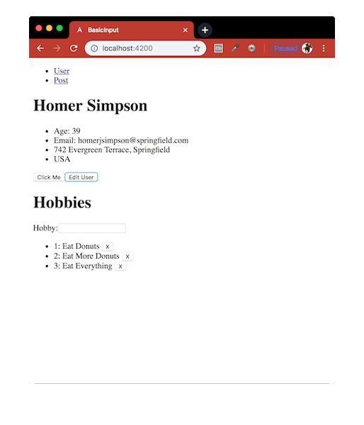

# BasicInput
Angular framework to look at all the fundamentals including Angular CLI, components, services, types, directives, events, HTTP, routing and more.

Credit to [Traversy Media](https://www.youtube.com/watch?v=KhzGSHNhnbI).



This project was generated with:
- [Node.js](https://nodejs.org/en/download/package-manager/) - Designed to build scalable network applications.
- [Angular CLI](https://github.com/angular/angular-cli) - A command line interface for Angular.

#### Installation
To run this project you will need to download it onto your local machine, navigate inside the folder and install all dependencies by entering the following command on your terminal window:
```
npm install
```
To run the server enter the following command in your terminal window:
```
ng serve -o
```
Run `ng e2e` to execute the end-to-end tests via [Protractor](http://www.protractortest.org/).
```
ng e2e
```
Open [http://localhost:4200](http://localhost:4200) to view it in the browser. If you make any changes and save the changes process will automatically refresh and you will be able to see the results in the browser.

If you want to end the process hold `control` and press `c` in mac, if you are not using mac hold `ctrl` and press `c`.

#### E2E Testing Result
```bash
Jasmine started

  Initial check on Basic Input App
    ✓ check correct HTML title appearing
    ✓ should display the default user name
    ✓ should display the h1 hobbies text

  User functionality check on Basic Input App
    ✓ should display the default user name
    ✓ should display the editted user name

Executed 5 of 5 specs SUCCESS in 6 secs.
[19:38:47] I/launcher - 0 instance(s) of WebDriver still running
[19:38:47] I/launcher - chrome #01 passed
```

#### Further Reading
- [Angular CLI](https://github.com/angular/angular-cli/wiki) - The Angular CLI is a tool to initialize, develop, scaffold and maintain Angular applications.
- [Interpolation and data-binding](https://docs.angularjs.org/guide/interpolation) - Interpolation markup with embedded expressions is used by AngularJS to provide data-binding to text nodes and attribute values.
- [Angular ngFor](https://blog.angular-university.io/angular-2-ngfor/) - Learn all Features including trackBy, why is it not only for Arrays?
- [Angular Forms Guide](https://blog.angular-university.io/introduction-to-angular-2-forms-template-driven-vs-model-driven/) - How the Angular Forms API works and how it can be used to build complex forms. 
- [Angular HTTP Client](https://blog.angular-university.io/angular-http/) - How to do HTTP in Angular in general.
- [Comprehensive Guide to Higher-Order RxJs Mapping Operators](https://blog.angular-university.io/rxjs-higher-order-mapping/) - RxJs higher-order mapping operators: switchMap, mergeMap, concatMap and exhaustMap.
- [ngIf directive](https://docs.angularjs.org/api/ng/directive/ngIf) - Removes or recreates a portion of the DOM tree based on an `{ expression }`.
- [Angular Router Fundamentals](https://blog.angular-university.io/angular2-router/) - Child Routes, Auxiliary Routes, Master-Detail.

[Return to create your first Angular app](../README.md)
