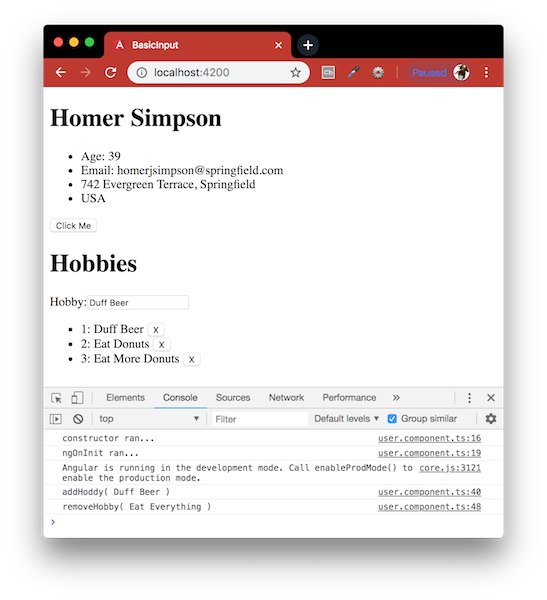

# BasicInput
Angular framework to look at all the fundamentals including Angular CLI, components, services, types, directives, events, HTTP, routing and more. Credit to [Traversy Media](https://www.youtube.com/watch?v=KhzGSHNhnbI).



This project was generated with:
- [Node.js](https://nodejs.org/en/download/package-manager/) - Designed to build scalable network applications.
- [Angular CLI](https://github.com/angular/angular-cli) - A command line interface for Angular.

#### Installation
To run this project you will need to download it onto your local machine, navigate inside the folder and install all dependencies by entering the following command on your terminal window:
```
npm install
```
Finally to run the server enter the following command in your terminal window:
```
ng serve -o
```
Open [http://localhost:4200](http://localhost:4200) to view it in the browser. If you make any changes and save the changes process will automatically refresh and you will be able to see the results in the browser.

If you want to end the process hold `control` and press `c` in mac, if you are not using mac hold `ctrl` and press `c`.

#### Further Reading
- [Angular CLI](https://github.com/angular/angular-cli/wiki) - The Angular CLI is a tool to initialize, develop, scaffold and maintain Angular applications.
- [Interpolation and data-binding](https://docs.angularjs.org/guide/interpolation) - Interpolation markup with embedded expressions is used by AngularJS to provide data-binding to text nodes and attribute values.
- [Angular ngFor](https://blog.angular-university.io/angular-2-ngfor/) - Learn all Features including trackBy, why is it not only for Arrays?

[Return to create your first Angular app](../README.md)
