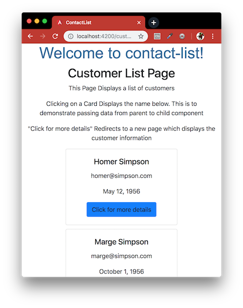

# ContactList
Creating a simple Angular 6 App using Angular CLI that consists of, a customer list page which lists out all the customers, and a customer details page which will display the details for the selected customer.



This project was generated with:
- [Node.js](https://nodejs.org/en/download/package-manager/) - Designed to build scalable network applications.
- [Angular CLI](https://github.com/angular/angular-cli) - A command line interface for Angular.
- [Bootstrap 4](http://getbootstrap.com/) - Build responsive, mobile-first projects on the web with the world's most popular front-end component library.

This App is a Simple Angular 6 App which uses:
1. Angular Components
2. HTTP Client
3. Angular Routing
4. Services
5. Very Basic Bootstrap
6. Communication from parent to child component

### Table of contents
- [Installation](#installation) - installing all dependencies
- [Created Components](#created-components) - three components used in the setup of the app
- [Created Services](#created-services) - get data from a rest API by making a HTTP request
- [Model Classes](#model-classes) - define the structure containing all and each customer details
- [Routing Module](#routing-module) - used to route between the 2 pages in the application

#### Installation
To run this project you will need to download it onto your local machine, navigate inside the folder and install all dependencies by entering the following command on your terminal window:
```
npm install
```
Finally to run the server enter the following command in your terminal window:
```
ng serve
```
Run `ng e2e` to execute the end-to-end tests via [Protractor](http://www.protractortest.org/).
```
ng e2e
```
Open [http://localhost:4200](http://localhost:4200) to view it in the browser. If you make any changes and save the changes process will automatically refresh and you will be able to see the results in the browser.

If you want to end the process hold `control` and press `c` in mac, if you are not using mac hold `ctrl` and press `c`.

#### Created Components

- **CustomersComponent**: This Component Is to Display the List of Customers

- **CustomerdetailsComponent**: This Component Displays the Details for a Single Selected Customer

- **DisplayComponent**: This Component Displays the Customer name Clicked in the *CustomersComponent* ( The whole point for this component is to demonstrate parent to child component communication ). This is a child component of *CustomersComponent*

#### Created Services

- **DataService**: All the Jsons used in the application are stored in assets/samplejson folder. DataService Helps in getting the Json from the assets/samplejson folder Using a Http Request . In Real Applications , the Service Helps to Get the Data from a Rest API or any other API by making a HTTP Request

#### Model Classes

- **Customer**: This is the model class used for the *CustomersComponent* to define the structure of each customer in the list

- **CustomerDetails**: This is the model class used for *CustomerdetailsComponent* to define the structure containing all the customer details

#### Routing Module

- **/customers**: This url displays the customer list and points to *CustomersComponent*

- **/customerdetails/id**: This url displays the details for each customer and points to *CustomerdetailsComponent*

#### E2E Testing Result
```bash
Jasmine started

  contact-list app
    ✓ use correct URL for Customer List Page
    ✓ should display h1 welcome message
    ✓ should display h2 heading title
    ✓ should display three paragraphs
    ✓ showing five card displays

Executed 5 of 5 specs SUCCESS in 6 secs.
[19:29:21] I/launcher - 0 instance(s) of WebDriver still running
[19:29:21] I/launcher - chrome #01 passed
```

#### Further Reading
- [Angular Components](https://angularfirebase.com/lessons/angular-components-basics-top-ten/) - Angular Components - Ten Basic Concepts.
- [Angular HTTP Client](https://blog.angular-university.io/angular-http/) - Quick practical guide for the Angular HTTP Client module.
- [Routing Made Easy](https://medium.com/coding-blocks/angular-6-routing-made-easy-part-1-f347c8a85947) - What if we have multiple paths in the same application?
- [Modules and Services](https://medium.com/@michelestieven/organizing-angular-applications-f0510761d65a) - Understanding Modules and Services …and using them to better organize applications!
- [Responsive Layouts](https://medium.com/@tomastrajan/how-to-build-responsive-layouts-with-bootstrap-4-and-angular-6-cfbb108d797b) - How To Build Responsive Layouts With Bootstrap 4 and Angular 6
- [Parent to Child component](https://angularfirebase.com/lessons/sharing-data-between-angular-components-four-methods/) - Sharing Data Between Angular Components - Four Methods

[Return to create your first Angular app](../README.md)
