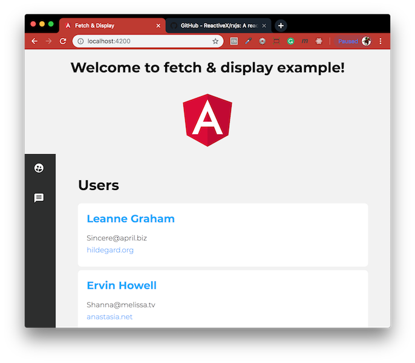
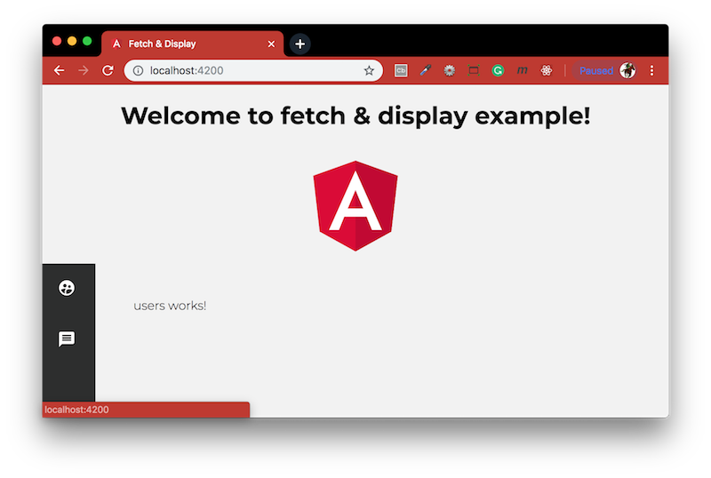
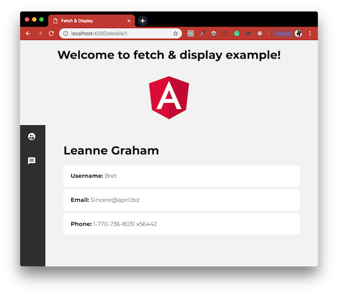
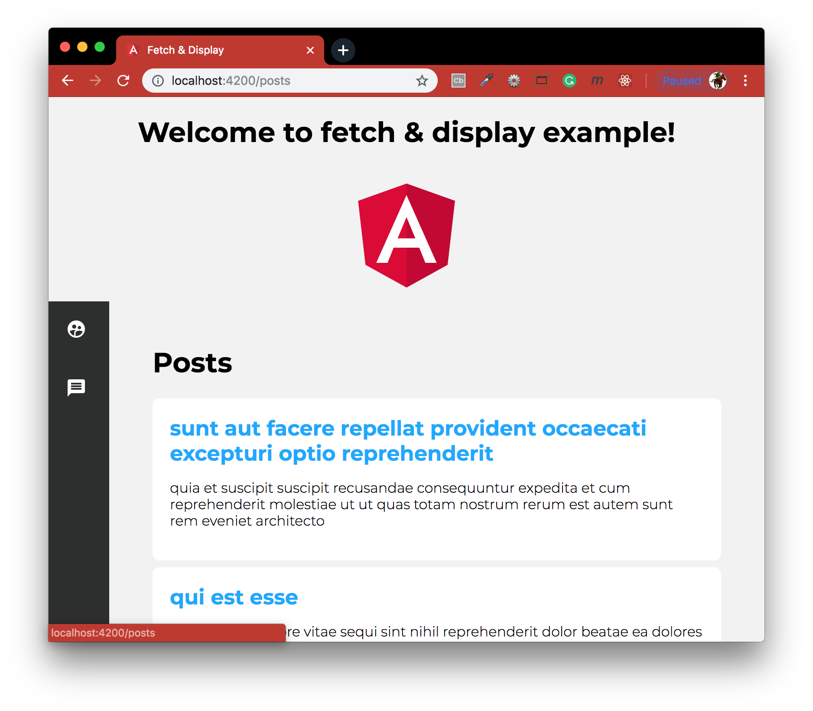

# FetchDisplay
Our app will fetch data from a mock API service and display it in a beautiful UI. Credit to [Gary Simon](https://www.youtube.com/watch?v=z4JUm0Bq9AM).



This project was generated with:
- [Node.js](https://nodejs.org/en/download/package-manager/) - Designed to build scalable network applications.
- [Angular CLI](https://github.com/angular/angular-cli) - A command line interface for Angular.
- [RxJS](https://github.com/ReactiveX/rxjs) - Reactive Extensions For JavaScript.

### Table of contents
- [Installation](#installation) - installing all dependencies
- [The Angular 6 Module File](#the-angular-6-module-file) - generating components taken care by CLI
- [Components Tutorial](#components-tutorial) - basic building blocks of your Angular app
- [Templating](#templating) - wrapping everything in a container & Material Icons setup
- [Routing Tutorial](#routing-tutorial) - import components into the Routes array
- [Services](#services) - fetch a list of users from a public API
- [HTTP Client](#http-client) - display users using the built in HTTPClient
- [Fetching More Data from the API](#fetching-more-data-from-the-api) - display details and posts for each users
- [Class Binding](#class-binding)
- [Animation Tutorial](#animation-tutorial)

#### Installation
To run this project you will need to download it onto your local machine, navigate inside the folder and install all dependencies by entering the following command on your terminal window:
```
npm install
```
Finally to run the server enter the following command in your terminal window:
```
ng serve -o
```
Open [http://localhost:4200](http://localhost:4200) to view it in the browser. If you make any changes and save the changes process will automatically refresh and you will be able to see the results in the browser.

If you want to end the process hold `control` and press `c` in mac, if you are not using mac hold `ctrl` and press `c`.

#### The Angular 6 Module File
The [app.module.ts](./src/app/app.module.ts) file looks like this:
```ts
import { BrowserModule } from '@angular/platform-browser';
import { NgModule } from '@angular/core';

import { AppRoutingModule } from './app-routing.module';
import { AppComponent } from './app.component';

@NgModule({ 
  declarations: [
    AppComponent
  ],
  imports: [
    BrowserModule,
    AppRoutingModule
  ],
  providers: [],
  bootstrap: [AppComponent]
})

export class AppModule { }
```
Whenever CLI is used to generate components and services, it will automatically update this file to import and add them to the `@NgModule` decorator. Components are added to the declarations array, and services are added as providers. Various imports is added to the imports array (i.e. animations). This is an important file which will need to visit routinely. The CLI will take care of things for the most part, especially when generating components, but when generating services and performing some other tasks, manual input is required.

#### Components Tutorial
A component in Angular provides you with the basic building blocks of your Angular app. When we used the Angular CLI to generate our project, it created a single component. When you use the CLI to generate components, it creates 4 files:
```bash
> src
  > app
    app.component.html
    app.component.scss (or .css)
    app.component.spec.ts
    app.component.ts
```
- The HTML file is the HTML template associated with that component.
- The SCSS or CSS is the associated CSS rulesets for that component.
- The .spec.ts file is for testing purposes.
- The .ts file is the actual component file. It defines a number of things.

Heres an [app.component.ts](./src/app/app.component.ts) file:
```ts
// import components and service files
import { Component } from '@angular/core';

// `@Component` decorator is an object with associated property/value pairs that defines important stuff associated with this component
@Component({
  // provides component with a unique identifier used in other areas of the app
  selector: 'app-root',
  // where this component's HTML and CSS files are located
  templateUrl: './app.component.html',
  styleUrls: ['./app.component.scss']
  // animation properties also added here
})

// logic section of the component file, where properties, dependency injection and methods are defined
export class AppComponent {
  title = 'app';
}
```
Now the basics of a component covered, let's create a few of our own! In the console, run:
```bash
> ng generate component sidebar
CREATE src/app/sidebar/sidebar.component.html (26 bytes)
CREATE src/app/sidebar/sidebar.component.spec.ts (635 bytes)
CREATE src/app/sidebar/sidebar.component.ts (274 bytes)
CREATE src/app/sidebar/sidebar.component.scss (0 bytes)
UPDATE src/app/app.module.ts (479 bytes)
```
Here, we've told the CLI to generate a component with the name of sidebar. It outputs the 4 files it created, along with the app module file it updated! Let's generate a few more components. Run the following commands to generate 3 more components:
```bash
> ng g c posts
> ng g c users
> ng g c details
```
Now, you should have a total of 5 components, 4 of which we just created ourselves.

#### Templating
We want our app to have a sidebar with some icons, where it will always be present in the app. The <b>sidebar</b> component is already generated with the CLI. In the [src/app/app.component.html](./src/app/app.component.html) file. You will see all of the boilerplate HTML the CLI generated, and what you see in the browser. Remove all of that and type this:
```html
<div id="container">
  <app-sidebar></app-sidebar>

  <div id="content">
    <router-outlet></router-outlet>
  </div>
</div>
```
We've wrapped everything in a <b>container</b> id. Then, you will notice a custom HTML element called <b>app-sidebar</b>, when the CLI generated the sidebar component, it made the component's selector value `app-sidebar`. Now, anything defined in that component's HTML, will be displayed where `app-sidebar` is defined.
Another very important element is the <b>router-outlet</b>, added by the CLI with the `--routing` flag. This element defines where any components defined by their routes will be displayed. Defining the sidebar templating in the [/src/app/sidebar/sidebar.component.html](./src/app/sidebar/sidebar.component.html) file:
```html
<nav>
  <ul>
    <li>
      <a routerLink="">
        <i class="material-icons">supervised_user_circle</i>
      </a>
    </li>
    <li>
      <a routerLink="posts">
        <i class="material-icons">message</i>
      </a>
    </li>
  </ul>
</nav>
```
Instead of <i>href</i>, we use <i>routerLink</i> to direct the user to different routes. Will be using <b>Material Icons</b> by adding the following lines in [/src/index.html](./src/index.html) between the `<head>` tags:
```html
<link href="https://fonts.googleapis.com/icon?family=Material+Icons" rel="stylesheet">
<link href="https://fonts.googleapis.com/css?family=Montserrat:300,700" rel="stylesheet">
```
Importing material icons first, and then a Google web font called Montserrat.

#### Routing Tutorial
Visiting the [/src/app/app-routing.module.ts](./src/app/app-routing.module.ts) file to make the 2 icons work when they're clicked:
```ts
import { NgModule } from '@angular/core';
import { Routes, RouterModule } from '@angular/router';

const routes: Routes = [];
@NgModule({
  imports: [RouterModule.forRoot(routes)],
  exports: [RouterModule]
})

export class AppRoutingModule { }
```
We need to import our components and add them to the Routes array:
```ts
...
import { UsersComponent } from './users/users.component';
import { DetailsComponent } from './details/details.component';
import { PostsComponent } from './posts/posts.component';

const routes: Routes = [
  {
    path: '',
    component: UsersComponent
  },
  {
    path: 'details/:id',
    component: DetailsComponent
  },
  {
    component: PostsComponent
  },
];
...
```
We've imported our 3 components (users, details, posts), and then defined three objects in the Routes array.
- The first object specifies that the `UsersComponent` will be the default component that loads on the root path. We leave the path value `empty` for this.
- The next route is for a user details section. We've specified a wildcard named `id`. We'll use this to fetch that value from the router in order to retrieve the correct user details.
- Then another route for a component and path called `posts`.



#### Services
We want to fetch a list of users from a public API for the users component by using Angular CLI to generate a service. In the console, type:
```bash
> ng generate service data
```
Open up the new service file [/src/app/data.service.ts](./src/app/data.service.ts):
```ts
import { Injectable } from '@angular/core';

@Injectable({
  providedIn: 'root'
})
export class DataService {
  constructor() { }
}
```
The purpose of the service file will be to communicate with an API via the Angular HTTP Client.

#### HTTP Client
Angular comes with a built in HTTPClient. Let's import that at the top of our [data.service.ts](./src/app/data.service.ts) file:
```ts
import { Injectable } from '@angular/core';
import { HttpClient } from '@angular/common/http';
```
Next, in order to use the HttpClient, we need to create an instance of it through dependency injection within the constructor:
```ts
constructor(private http: HttpClient) { }
getUsers() {
return this.http.get('https://jsonplaceholder.typicode.com/users')
}
```
We also defined a method called `getUsers()` which we'll call in our component shortly. It returns a list of users from a public testing API. Before we can use the HTTPClient, we need to add as an import in our app's [/src/app/app.module.ts](./src/app/app.module.ts) file:
```ts
...
import { HttpClientModule } from '@angular/common/http'; // <-Add here

@NgModule({
  declarations: [
    ...
  ],
  imports: [
    BrowserModule,
    AppRoutingModule,
    HttpClientModule, // <-Add here
  ],
  providers: [],
  bootstrap: [AppComponent]
})
```
Next, let's open up the [/src/app/users/users.component.ts](./src/app/users/users.component.ts) file and import our service:
```ts
import { Component, OnInit } from '@angular/core';
import { DataService } from '../data.service';
import { Observable } from 'rxjs';
```
To display the results, we're going to use an `Observable`, so we're importing it here, too. In the class, add:
```ts
export class UsersComponent implements OnInit {
  
  users$: Object;
  
  constructor(private data: DataService) { }
  
  ngOnInit() {
    this.data.getUsers().subscribe(
      data => this.users$ = data
    );
  }
}
```
In the constructor, we're creating an instance of our service. Then, within the lifecycle hook `ngOnInit()` (this runs when the component loads), we're calling our `getUsers()` method and subscribing to it. Inside, we're binding our `users$` object to the result returned by the API.
Next, open up [/src/app/users/users.component.html](./src/app/users/users.component.html):
```html
<h1>Users</h1>

<ul>
  <li *ngFor="let user of users$">
    <a routerLink="/details/{{user.id}}">{{ user.name }}</a>
    <ul>
      <li>{{ user.email }}</li>
      <li><a href="http://{{ user.website }}">{{ user.website }}</a></li>
    </ul>
  </li>
</ul>
```
Whenever you wish to iterate over an array or array of objects, you use the Angular directive `*ngFor`. We then use interpolation brackets to call upon the properties of the returned object to display them in the browser!


#### Fetching More Data from the API
Let's revisit the service file [/src/app/data.service.ts](./src/app/data.service.ts) and add the following methods:
```ts
getUser(userId) {
  return this.http.get('https://jsonplaceholder.typicode.com/users/' + userId)
}
getPosts() {
  return this.http.get('https://jsonplaceholder.typicode.com/posts')
}
```
The `getUser()` method will provide us with a single user's information, which will accept a userId as a parameter.
`getPosts()` will fetch some fictional posts for us to get more muscle memory with this process of communicating with services. Visit [/src/app/details/details.component.ts](./src/app/details/details.component.ts):
```ts
import { Component, OnInit } from '@angular/core'; 
import { DataService } from '../data.service';
import { Observable } from 'rxjs';
import { ActivatedRoute } from "@angular/router";

@Component({
  selector: 'app-details',
  templateUrl: './details.component.html',
  styleUrls: ['./details.component.scss']
})
export class DetailsComponent implements OnInit {

  user$: Object;
  
  constructor(private route: ActivatedRoute, private data: DataService) {
    this.route.params.subscribe( params => this.user$ = params.id );
  }
  ngOnInit() {
    this.data.getUser(this.user$).subscribe(
      data => this.user$ = data
    );
  }
}
```
This, as you see, is very similar to our users component. The only difference comes when we import `ActivatedRoute` and call it within the constructor.
The purpose of this code allows us to grab the `id` router parameter that we defined in the app's routing file earlier. This will give us access to the user ID and then pass it to the getUser() method that we defined.
Open up the [details.component.html](./src/app/details/details.component.html) and specify:
```html
<h1>{{ user$.name }}</h1>
<ul>
  <li><strong>Username:</strong> {{ user$.username }}</li>
  <li><strong>Email:</strong> {{ user$.email }}</li> 
  <li><strong>Phone:</strong> {{ user$.phone }}</li>
</ul>
```



For more muscle memory, let's repeat this process for the [/src/app/posts/posts.component.ts](./src/app/posts/posts.component.ts) file:
```ts
import { Component, OnInit } from '@angular/core'; 
import { DataService } from '../data.service'; 
import { Observable } from 'rxjs';

@Component({
  selector: 'app-posts',
  templateUrl: './posts.component.html',
  styleUrls: ['./posts.component.scss']
})
export class PostsComponent implements OnInit {
  posts$: Object;
  constructor(private data: DataService) { }
  ngOnInit() {
    this.data.getPosts().subscribe(
      data => this.posts$ = data
    );
  }
}
```
And the [posts.component.html](./src/app/posts/posts.component.html) file:
```html
<h1>Posts</h1>
<ul>
  <li *ngFor="let post of posts$">
    <a routerLink="">{{ post.title }}</a>
    <p>{{ post.body }}</p>
  </li>
</ul>
```



#### Class Binding

#### Animation Tutorial

#### Further Reading
- [Angular Components](https://angularfirebase.com/lessons/angular-components-basics-top-ten/) - Angular Components - Ten Basic Concepts.

[Return to create your first Angular app](../README.md)
