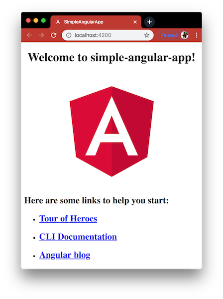

# First Angular app
Creating a simple Angular 6 App using Angular CLI.



This project was generated with:
- [Node.js](https://nodejs.org/en/download/package-manager/) - Designed to build scalable network applications.
- [Angular CLI](https://github.com/angular/angular-cli) - A command line interface for Angular.

### Table of contents
- [Install Angular CLI](#install-angular-cli)
- [Create the Project](#create-the-project)
- [Basic Folder Structure Explained](#basic-folder-structure-explained)
- [Creating Components and Services](#creating-components-and-services)

#### Install Angular CLI
Angular CLI is a command line interface for Angular, and is very useful in quickly creating an Angular 6 project template. Install the Angular CLI npm package globally using the following command:
```bash
npm install -g @angular/cli
```

#### Create the Project
Angular CLI helps in creating a project very easily, using the following command:
```bash
ng new simple-angular-app
```
`simple-angular-app` is the name of the project which will also create a folder named `simple-angular-app`. Go into the project folder and run the application using the following commands:
```bash
cd simple-angular-app
npm start
```
Go to your browser and go the following URL: [http://localhost:4200](http://localhost:4200). You should be able to see that your application is running.

#### Basic Folder Structure Explained
Here I will list out some of the important files and folders created:
1. `package.json:` This file has the list of node dependencies which are needed.
2. `src/styles.css:` This file has the global CSS available throughout the application.
3. `src/main.ts:` This is the main file which starts the Angular Application. Extension `.ts` stands for TypeScript.
4. `src/index.html:` This the first file which executes alongside `main.ts` when the page loads.
5. `src/app/app.module.ts:` This is the file where all the components, providers, and modules are defined. Without defining them here, they can’t be used elsewhere in the code.
6. `src/app/app.component.html:` This is the main component of an angular app, and all other components are usually present within this component. `src/app/app.component.ts` is the logic for this component, and `src/app/app.component.css` is the CSS for this component. This component acts as a container for other components.
7. `dist:` This folder is where the built files are present. TypeScript is basically converted to JavaScript and the resulting files are stored here after bundling. (This Folder appears only if the application is built) It is necessary to convert TypeScript to JavaScript before deploying the code since browsers only understand JavaScript. Following command will create this folder:
```bash
npm run build
```

#### Creating Components and Services
1. `Component:` A component in Angular does a specific function. An Angular application is built by using various components. Angular CLI can be used to create components easily. The syntax is `ng generate component [name]`. Use the following command to create a component called `customers`.
```bash
ng generate component customers
```
2. The above command creates a folder called customers inside `src/app`. The component created has:
- a `customers.component.html` file to decide the template (how the component UI should look )
- a `customers.component.ts` file which is where the logic is present
- a `customers.component.css` file which has CSS content
- and a `customers.component.spec.ts` file which is used for unit testing
3. `Service:` A service basically provides functionality which can be used by any component. The service can be shared across all components, or it can be restricted to a particular component (any reusable logic can be put in a service). Angular CLI can be used to create services as well. The syntax is `ng generate service [name]`. Use the following command to create a service called `data`:
```bash
ng generate service data
```
4. The service is created inside `src/app`. The service created has a `data.service.ts` file which has the logic and a `data.service.spec.ts` file for unit testing.

#### Further Reading
- [Tutorial: Tour of Heroes](https://angular.io/tutorial) - In this tutorial you will build an app that helps a staffing agency manage its stable of heroes.
- [Angular CLI](https://github.com/angular/angular-cli/wiki) - The Angular CLI is a tool to initialize, develop, scaffold and maintain Angular applications.
- [Angular Blog](https://blog.angular.io/) - News and Tips from the Angular Team.

[Return to create your first Angular app](../README.md)
