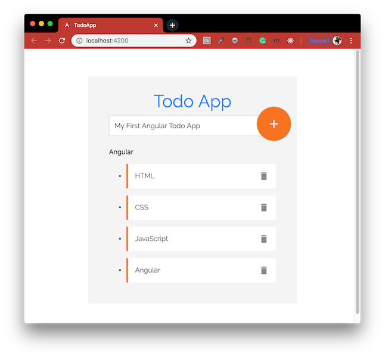
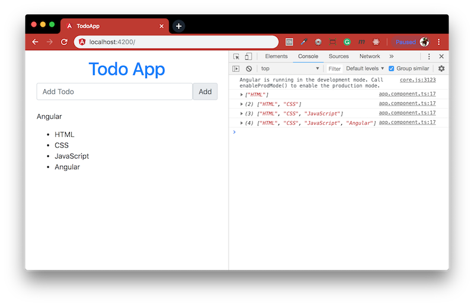
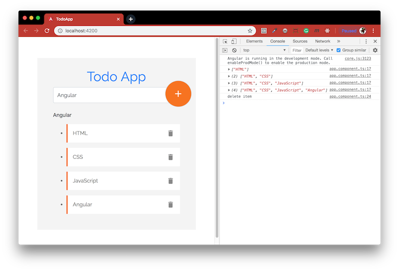

# Angular to-do app!
Building Todo app using Angular CLI.



This project was generated with:
- [Node.js](https://nodejs.org/en/download/package-manager/) - Designed to build scalable network applications.
- [Angular CLI](https://github.com/angular/angular-cli) - A command line interface for Angular.
- [Bootstrap 4](http://getbootstrap.com/) - Build responsive, mobile-first projects on the web with the world's most popular front-end component library.
- [Google-fonts](https://fonts.google.com/) - Making the web more beautiful, fast, and open through great typography.
- [Material-icons](https://material.io/icons/) - Delightful, beautifully crafted symbols for common actions and items.

### Table of contents
- [Adding an item](#adding-an-item) - learn how to submit a form in Angular
- [Removing an item](#removing-an-item) - learn how to add an event in Angular
- [Angular animation](#angular-animation) - learn how animate the components

#### Installation
To run this project you will need to download it onto your local machine, navigate inside the folder and install all dependencies by entering the following command on your terminal window:
```
npm install
```
Finally to run the server enter the following command in your terminal window:
```
ng serve
```
Open [http://localhost:4200](http://localhost:4200) to view it in the browser. If you make any changes and save the changes process will automatically refresh and you will be able to see the results in the browser.

If you want to end the process hold `control` and press `c` in mac, if you are not using mac hold `ctrl` and press `c`.

#### Adding an item


#### Removing an item


#### Angular animation

[Return to create your first Angular app](../README.md)
